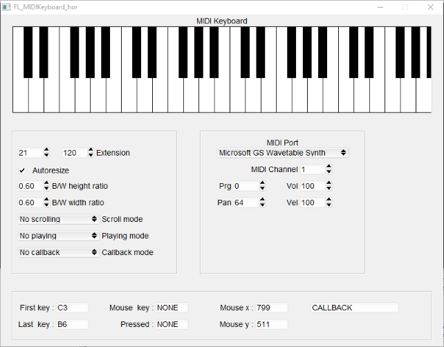
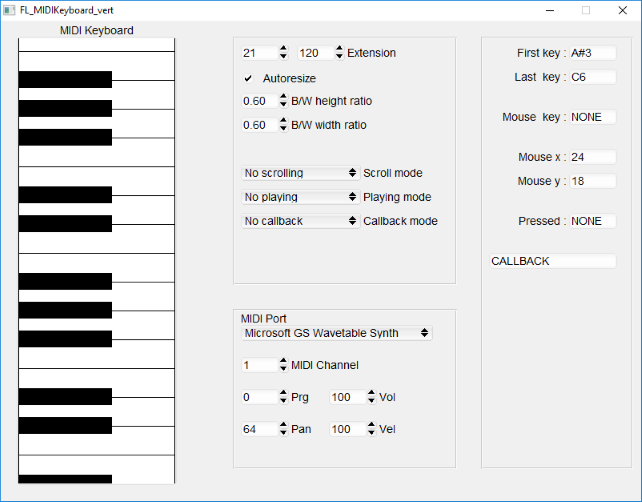

Fl_MIDIKeyboard
===============

A MIDI Keyboard widget based on FLTK toolkit

The Fl_MIDIKeyboard is a widget developed with FLTK GUI Toolkit (see <http://www.fltk.org>) by __Nicola Cassetta__.
It allows the user to incorporate into FLTK environment a piano keyboard capable to send MIDI messages to the computer
MIDI ports.

It includes these features:
- Horizontal or vertical keyboard
- Customizable range
- Variable ratio between white/black keys height and width
- Resizing and autoresizing of keys
- Scrolling with a scrollbar, with the arrow keys on the computer keyboard or with the mouse
- Playing with a mouse click on the keys or with the computer keyboard (this mode allows playing chords)
- Callbacks can be executed when a key is pressed or released
- Can send these MIDI messages: Note On/Off, Program change, Volume, Pan

The widget uses RtMidi library (see <http://www.music.mcgill.ca/~gary/rtmidi/> to communicate with the hardware of the computer
regardless of operating system. It consists of only one source file and two headers, so it has been incorporated into the source.

The features are shown in the sample programs test_Fl_MIDIKeyboard_hor.cpp and test_Fl_MIDIKeyboard_vert.cpp.

See the __BUILDING THE WIDGET__ page in the docs for building the widget.

Thanks Nicola Cassetta

P.S. Any feedback would be appreciated

Sample programs pictures:
-------------------------

The horizontal keyboard

Yhr vertical keyboard

